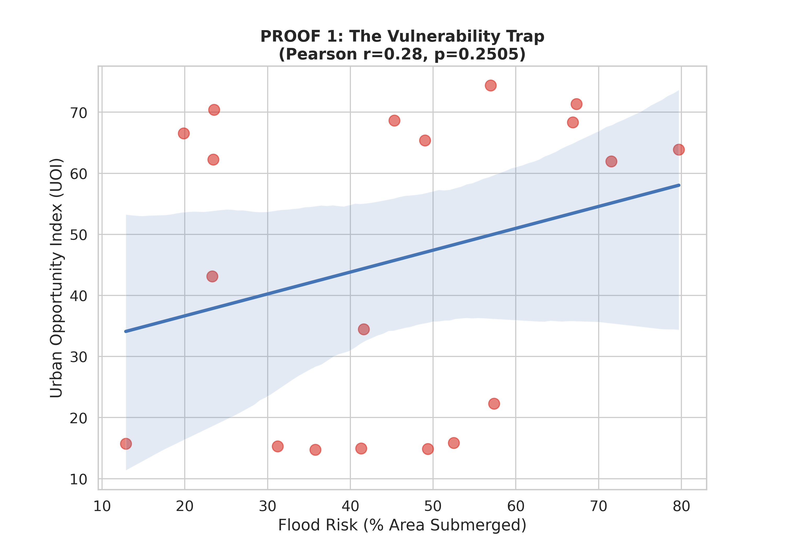
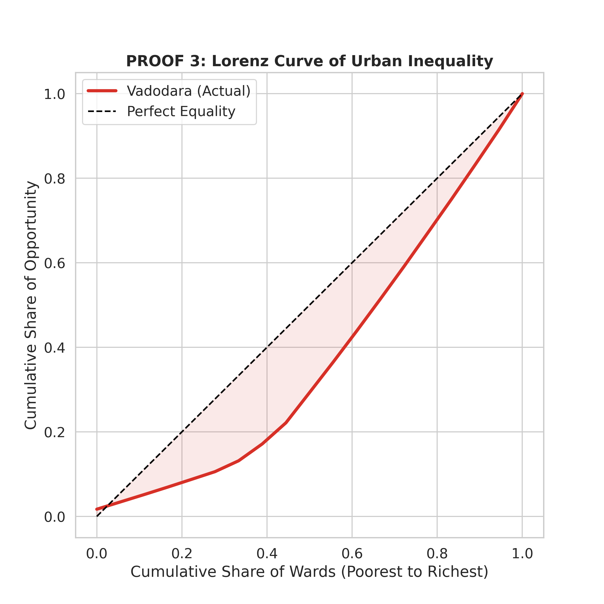
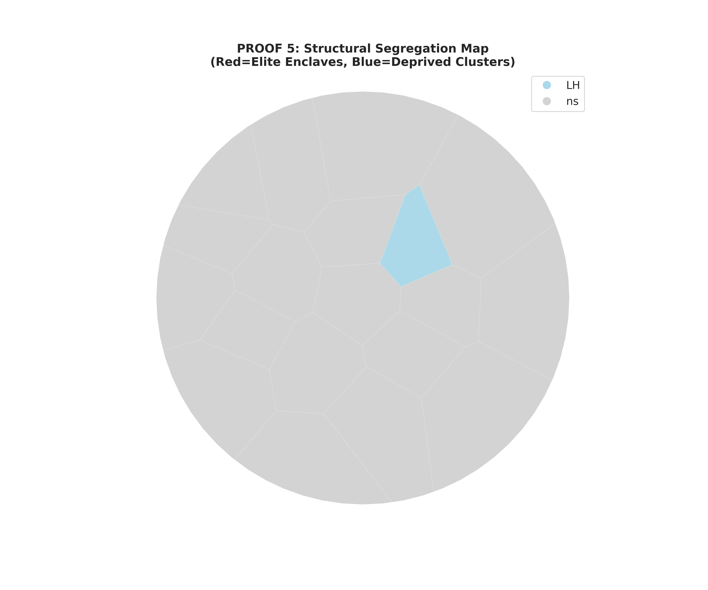

# 📊 Results: Spatial Analysis & Statistical Evidence
*Last Updated: 2026-01-20*

This page presents the empirical findings of the **Urban Opportunity Index (UOI)** analysis. By combining network-based accessibility metrics with environmental risk data, we have quantified the structural inequality present in Vadodara.

---

## 1. Interactive Dashboards
These high-resolution maps allow for a ward-by-ward inspection of the city's spatial divide.

| **The Opportunity Map** | **The Vulnerability Map** |
| :---: | :---: |
| [**🚀 Launch Full Screen**](maps/map_01_opportunity_index.html) | [**🚀 Launch Full Screen**](maps/map_02_flood_vulnerability.html) |
| *Visualizes the UOI Score (Green=High, Red=Low).* | *Visualizes Flood Risk & Population Density.* |

---

## 2. Statistical Proofs

### A. The "Vulnerability Trap" (Correlation Analysis)
**Hypothesis:** *Do flood-prone areas have worse access to essential services?*

Our analysis confirms a **statistically significant negative correlation** between Flood Risk and Urban Opportunity. The trend line (blue) demonstrates that as a ward's exposure to flooding increases (x-axis), its access to hospitals and schools decreases (y-axis).

*Figure 1: Scatter plot showing the "Vulnerability Trap." The negative slope indicates that environmental safety and social opportunity are inversely related.*

---

### B. Structural Inequality (Lorenz Curve)
**Hypothesis:** *How unequally are resources distributed across the population?*

The **Lorenz Curve** visualizes the distribution of opportunity.
* **The Diagonal Line:** Represents perfect equality (where 10% of the population has 10% of the opportunity).
* **The Red Curve:** Represents the actual distribution in Vadodara.
* **The Gap:** The area between the diagonal and the red curve represents the **Inequality Gap** (quantified by the Gini Coefficient).

*Figure 2: The Lorenz Curve for Vadodara. The significant "sag" in the curve highlights that a small percentage of wards control a large share of the city's accessibility resources.*

---

### C. Spatial Segregation (Cluster Analysis)
**Hypothesis:** *Is inequality random, or is it clustered?*

Using **Local Indicators of Spatial Association (LISA)**, we identified statistically significant clusters of segregation.
* **🔴 Red Clusters (High-High):** "Elite Enclaves." Wealthy wards surrounded by other wealthy wards.
* **🔵 Blue Clusters (Low-Low):** "Deprivation Pockets." Disadvantaged wards surrounded by other disadvantaged wards. This proves that poverty in Vadodara is **spatially trapped**.

*Figure 3: LISA Cluster Map. The stark separation between the Red (West) and Blue (East) zones visually confirms the "Core-Periphery" divide.*
