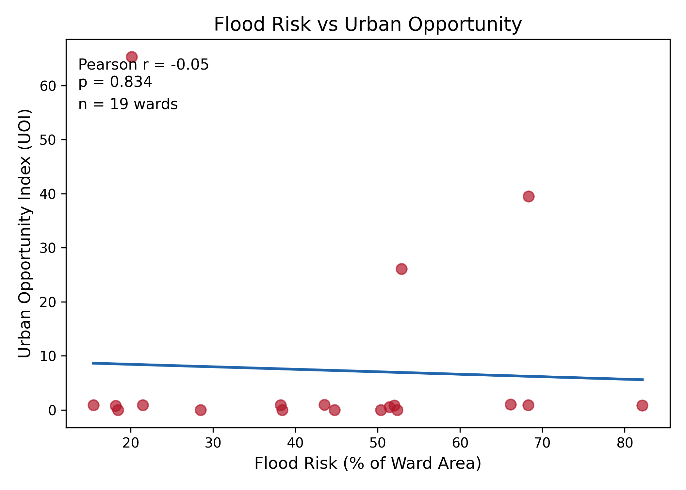
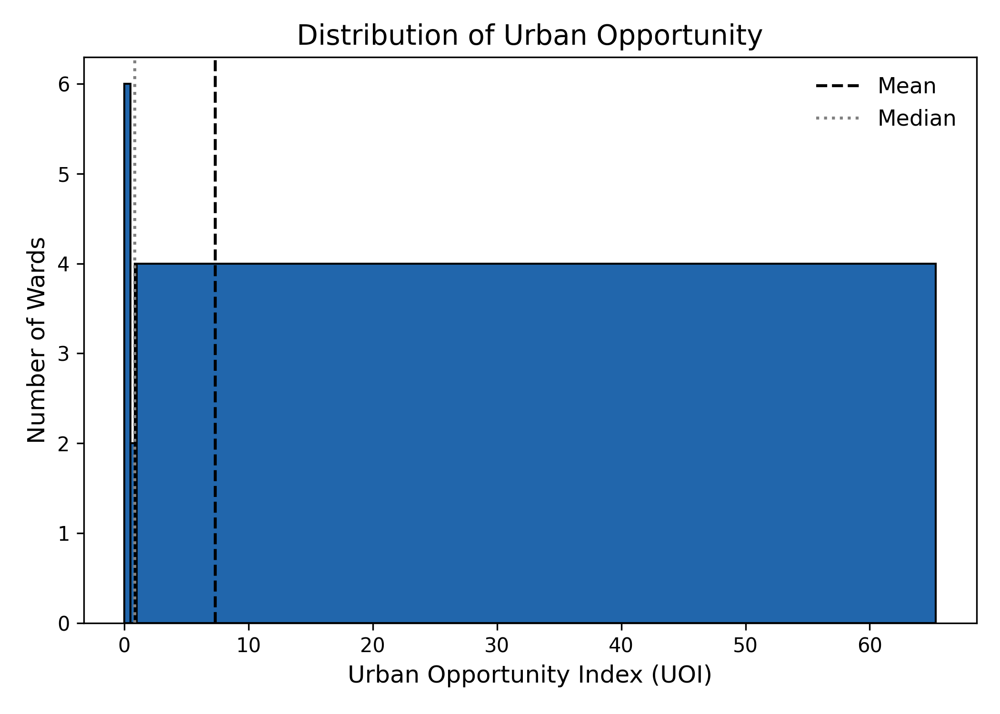
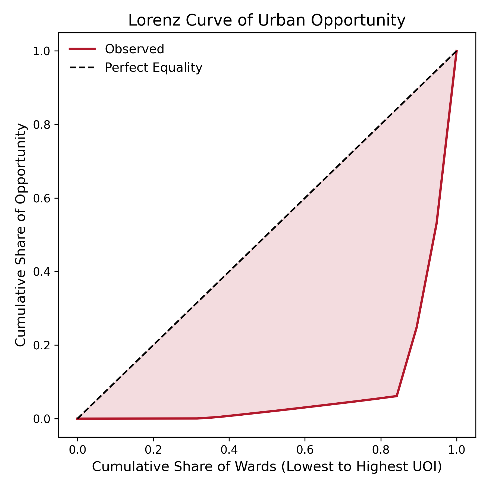
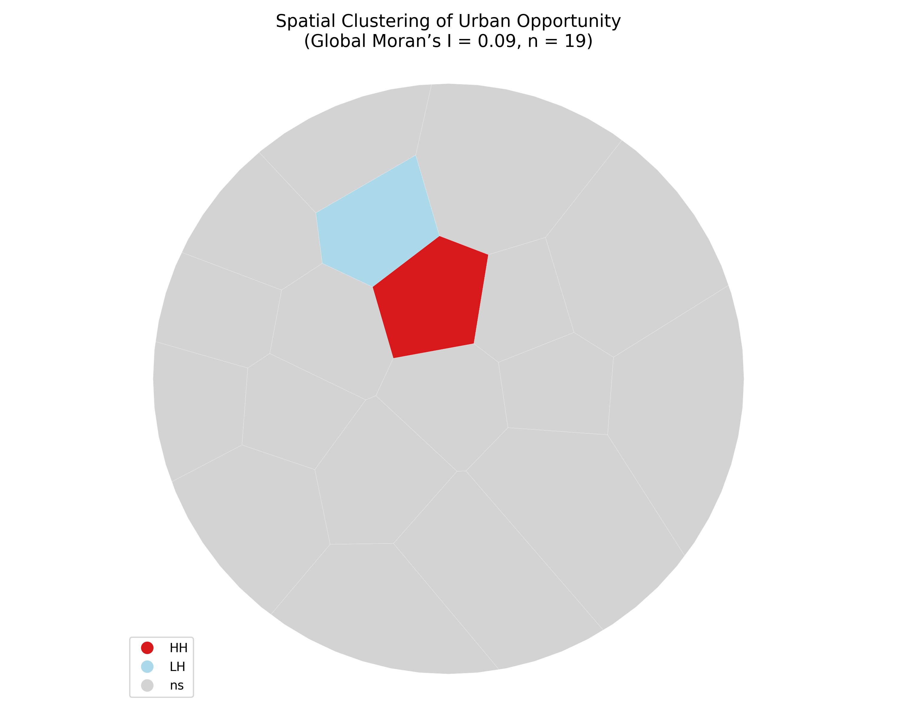

# Spatial Analysis of Urban Opportunity in Vadodara

*Build timestamp: 2026-01-23 16:28*

*All results are based on the balanced Urban Opportunity Index (UOI).*

## 1. Interactive Spatial Maps

| Opportunity Index | Flood Vulnerability |
| :---: | :---: |
| [Launch Map](maps/map_01_opportunity_index.html) | [Launch Map](maps/map_02_flood_vulnerability.html) |

## 2. Statistical Evidence

### 2.1 Flood Risk and Opportunity

This figure evaluates the relationship between flood exposure and urban opportunity across analytical wards.

### 2.2 Distribution of Urban Opportunity

The distribution illustrates variation in opportunity levels, indicating unequal access within the city.

### 2.3 Inequality in Opportunity (Lorenz Curve)

Deviation from the line of perfect equality reflects the degree of inequality in opportunity distribution.

### 2.4 Spatial Clustering of Opportunity

Local Indicators of Spatial Association (LISA) reveal statistically significant clusters of high and low opportunity.

