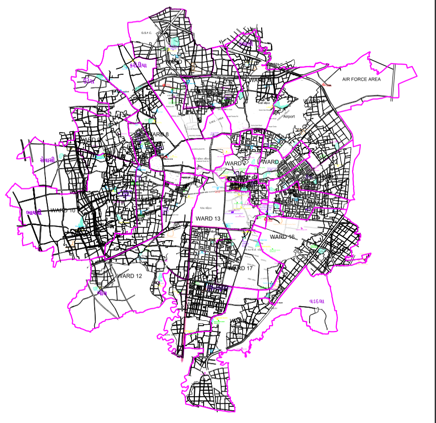
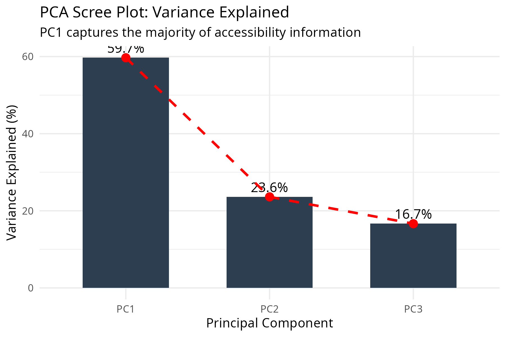

# Modeling Urban Inequality in Vadodara

### A Geospatial & Network-Based Analysis

**Ethan Hunt**  
Master’s Student — Statistics  
The Maharaja Sayajirao University of Baroda

Note:
Brief intro. Mention thesis context and motivation.
---
## Motivation

- Urban inequality is spatially uneven
- City-wide averages hide local deprivation
- Infrastructure is experienced through movement

**Core Idea:**  
Access, not availability, defines opportunity.
---
## Research Questions

- Is access to essential services spatially equitable?
- Do deprived wards form persistent clusters?
- How does network-based accessibility differ from Euclidean distance?
- Can opportunity be measured objectively?
---
## Conceptual Framework

- City modeled as a **road network**
- Opportunity measured via **travel time**
- Inequality tested using **spatial statistics**
--
### Analytical Layers

1. Network modeling  
2. Accessibility computation  
3. Spatial dependence analysis
---
## Data & Study Area

- 19 administrative wards (post-2011)
- OpenStreetMap road network
- Hospitals, schools, transport nodes
--
### Network Scale

- ~50,000 nodes  
- ~120,000 edges  
- Travel-time weighted
---
## Study Area

Administrative wards used for analysis.
---
## Methodology: Network Accessibility

- Graph-based representation of city
- Shortest-path algorithms
- Travel-time based access

**Why not Euclidean distance?**  
Cities are navigated, not flown over.
---
## Urban Opportunity Index (UOI)

- Indicators standardized
- PCA-based aggregation
- Objective, variance-driven weights
--
### Why PCA?

- Avoids arbitrary weighting
- Captures multidimensional access
- Statistically interpretable
---
## Urban Opportunity Index Map

Higher values indicate greater access to services.
---
## Spatial Validation

- Global Moran’s I
- Local Moran’s I (LISA)

Tests whether inequality is random or spatially structured.
--
### LISA Identifies

- High–High clusters (privilege)
- Low–Low clusters (deprivation)
- Spatial outliers
---
## LISA Cluster Map

Spatial traps and privilege corridors are visible.
---
## Global Spatial Autocorrelation

Positive slope indicates spatial dependence.
---
## PCA Diagnostics

First component captures majority variance → used for UOI.
---
## Key Findings

- Inequality is spatially structured
- Western wards show opportunity clustering
- Central wards exhibit deprivation traps
- Transport connectivity is critical
---
## Policy Implications

1. Targeted ward-level intervention  
2. Transport as an equity lever  
3. Spatial diagnostics > city averages
---
## Phase 2: Validation

- Stratified household survey
- High / Medium / Low UOI wards
- ~200 households
--
### Objective

Compare modeled accessibility with lived experience.
---
## Conclusion

- Urban inequality is spatially entrenched
- Networks shape opportunity
- Spatial statistics reveal hidden structure

**Cities are not just built — they are experienced.**
---
## Thank You

Questions?
