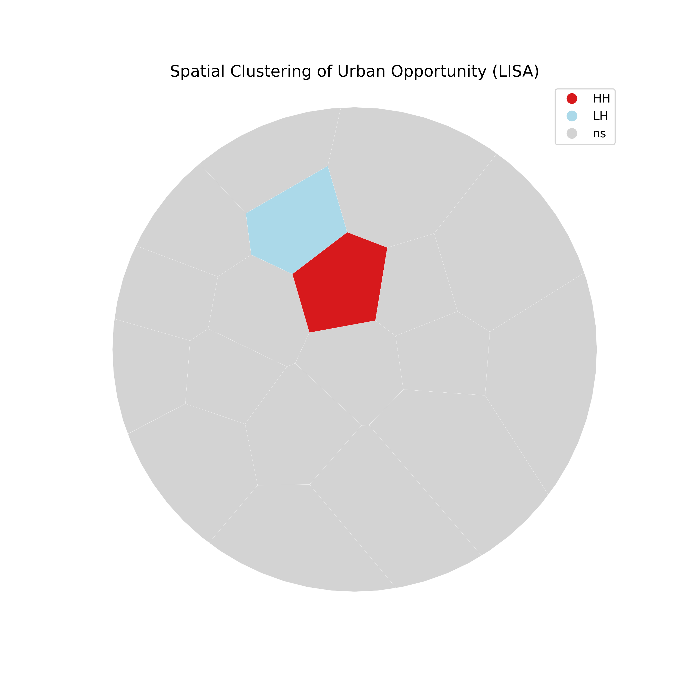

Spatial Autocorrelation Analysis (Moran's I)

Objective: To determine if the spatial distribution of the Urban Opportunity Index (UOI) is random or statistically clustered, thereby proving whether inequality in Vadodara is structural.
1. Rationale

    First Law of Geography: "Everything is related to everything else, but near things are more related than distant things" (Tobler, 1970).

    Testing for Segregation: If low-opportunity wards are statistically clustered together, it provides mathematical proof of a "Spatial Trap" or ghettoization. It confirms that disadvantage is not an isolated accident but a regional, systemic failure.

2. Methodology
A. Spatial Weights Matrix (W)

    Method: K-Nearest Neighbors (KNN=4).

    Why KNN? Unlike Queen's Contiguity, which requires shared borders, KNN ensures that every ward—even isolated peripheral ones—has a valid set of neighbors. This prevents "island errors" in the statistical model, which is critical for edge-case wards in the 9km buffer zone.

    Standardization: The weights matrix is row-standardized (Wij​) so that the influence of neighbors sums to 1.

B. Global Moran's I

    The Metric: A single summary statistic that measures the degree of clustering across the entire city.

    Null Hypothesis (H0​): The UOI scores are randomly distributed across Vadodara.

    Test: A Monte Carlo permutation test (999 simulations) is run to establish statistical significance (p<0.05).

    Interpretation:

        I>0: Positive Autocorrelation (High scores cluster with High scores). Proof of Segregation.

        I≈0: Random distribution. No structural inequality.

C. Local Moran's I (LISA)

    The Map: Local Indicators of Spatial Association (LISA) decompose the global statistic to identify specific local clusters.

    Cluster Types Identified:

        High-High (HH): "Elite Enclaves" — High opportunity wards surrounded by other high opportunity wards (e.g., Alkapuri, Akota).

        Low-Low (LL): "Deprivation Pockets" — Low opportunity wards surrounded by other low opportunity wards. This represents the 'Vulnerability Trap'.

        High-Low / Low-High: "Spatial Outliers" — Transitions or unequal borders.

3. Outputs & Evidence

This analysis generates two key visual proofs for the thesis:

    Figure 04: Moran Scatterplot
    

        A scatter plot showing the relationship between a ward's UOI score and its neighbors' average score. The slope of the line equals the Global Moran's I value.

    Figure 05: LISA Cluster Map
    

        A geographic map painting the city in four colors:

            🔴 Red: High-High Clusters (The Privileged Core).

            🔵 Blue: Low-Low Clusters (The Deprived Periphery/Flood Zone).

        This map is the definitive visual argument for Spatial Justice.

4. Academic References

    Anselin, L. (1995). "Local Indicators of Spatial Association—LISA." Geographical Analysis.

    Cliff, A. D., & Ord, J. K. (1981). Spatial Processes: Models & Applications.
