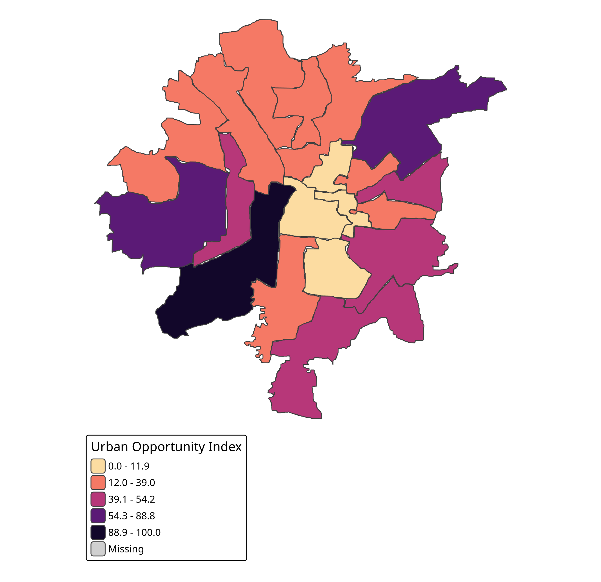
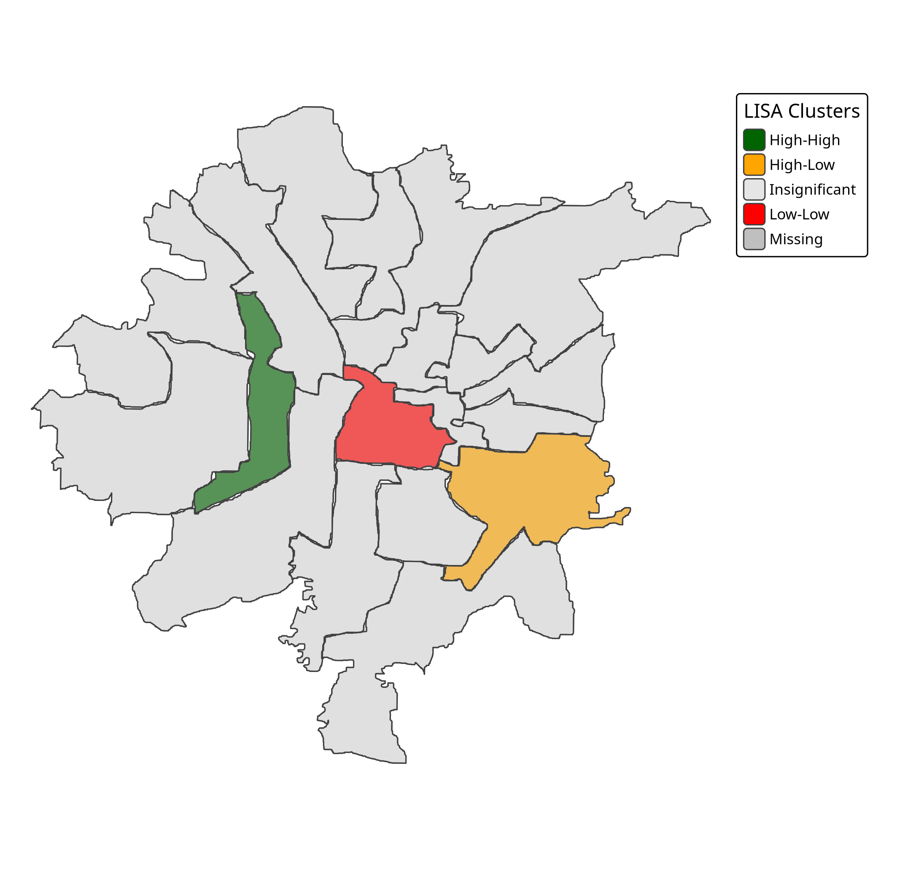
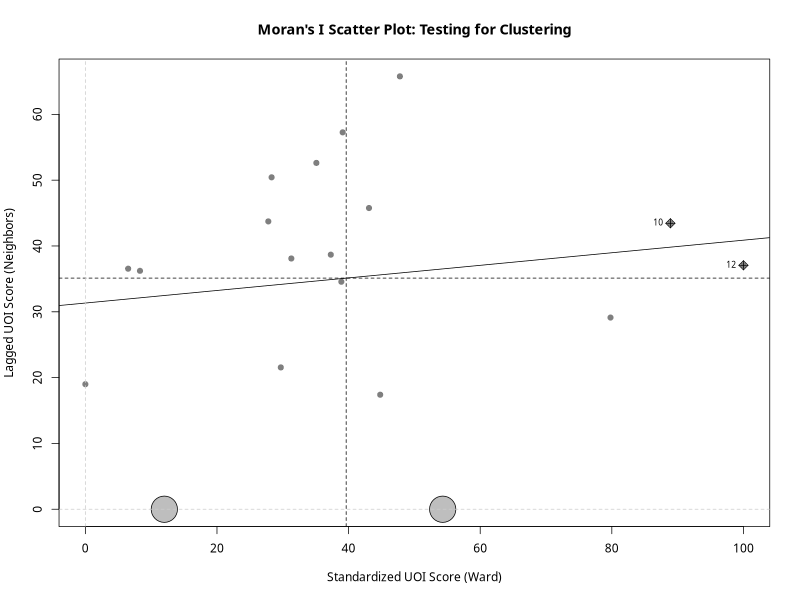

````markdown
# 🏙️ Modeling Urban Inequality in Vadodara  
### *A Geospatial & Network-Based Analysis*

<p align="center">
  
  
  
</p>

---

## 📌 Project Overview
🎓 **Master’s Thesis**  
**Department of Statistics, The Maharaja Sayajirao University of Baroda**

This research models **urban inequality as a spatial and network phenomenon**, not merely a socioeconomic one.

By constructing a **Digital Twin of Vadodara City (19 administrative wards)**, the study measures *realistic* access to essential services—**hospitals, schools, and public transport**—using **actual road networks** rather than straight-line distances.

The results are integrated into a composite **Urban Opportunity Index (UOI)** using **Principal Component Analysis (PCA)** and validated through **spatial statistical inference**.

---

## 🧠 Core Research Questions
- ❓ *Is access to public services spatially equitable across the city?*
- ❓ *Do areas of deprivation form persistent spatial clusters?*
- ❓ *Can network-based accessibility reveal inequalities hidden by averages?*

---

## 🚀 Key Features & Contributions

✨ **Primary Spatial Data Creation**  
- Digitized and georeferenced the **current 19-ward administrative boundary** of Vadodara  
- Addresses the **post-2011 Census spatial data gap**

🛣️ **Network-Based Accessibility Modeling**  
- Road network sourced from **OpenStreetMap**
- Graph scale: **50,000+ nodes**, **120,000+ edges**
- Travel time computed using **graph theory (shortest paths)**

📊 **Urban Opportunity Index (UOI)**  
- Constructed via **PCA**
- Objective, variance-driven weighting of services
- Avoids arbitrary index construction

📍 **Spatial Statistical Validation**  
- **Global Moran’s I** → city-wide spatial dependence  
- **LISA (Local Moran’s I)** → identification of:
  - 🔥 Hotspots of privilege  
  - ❄️ Coldspots of deprivation  
- Empirical evidence of **Spatial Traps**

---

## 🗂️ Project Structure

```text
URBAN-INEQUALITY-IN-BARODA/
├── data/
│   ├── raw/                 # Digitized Ward Boundaries (GeoJSON)
│   ├── interim/             # Spatial Database (GeoPackage)
│   └── processed/           # Final CSVs & Index Scores
│
├── scripts/
│   ├── python/              # Data Engineering & Network Analysis
│   └── R/                   # Statistical Modeling & Inference
│
├── output/
│   └── maps/                # Final Maps & Figures
│
├── docs/                    # Methodology & Academic Notes
├── requirements.txt
├── install_packages.R
└── README.md
````

---

## 🖼️ Visual Outputs & Figures

> 📌 *All figures are generated programmatically and stored in `output/maps/`*

### 🗺️ Figure 1: Urban Opportunity Index (UOI)

*Spatial distribution of opportunity across Vadodara wards*

```text
output/maps/01_UOI_Map.png
```



---

### 🔥 Figure 2: LISA Cluster Map (Hotspots & Coldspots)

*Local clusters of high and low opportunity*

```text
output/maps/02_LISA_Cluster_Map.png
```



---

### 📈 Figure 3 (Optional): Moran’s I Scatter Plot

*Global spatial autocorrelation diagnostic*

```text
output/maps/03_Moran_Scatter.png
```



> *(Generated optionally for interpretive support in thesis chapters)*

---

## 📊 Key Findings — Phase 1

| 📌 Metric                   | 📈 Result                 | 🧠 Interpretation                                   |
| --------------------------- | ------------------------- | --------------------------------------------------- |
| 🏆 **Most Privileged Ward** | **Ward 12** (UOI = 100.0) | Excellent hospital access, dense road connectivity  |
| ⚠️ **Most Deprived Ward**   | **Ward 14** (UOI = 0.0)   | Structural *Service Desert*                         |
| 🌍 **Global Moran’s I**     | `0.056` (p > 0.05)        | Inequality is **not random in space**               |
| 🧩 **LISA Analysis**        | Significant clusters      | West: *Privilege Corridor* · Center: *Poverty Trap* |

---

## 🏛️ Policy Implications

This research demonstrates that **urban inequality is spatially entrenched**, not evenly distributed.

### 🎯 Key Policy Insights

**1️⃣ Targeted Infrastructure Investment**

* Low-Low (LL) clusters represent **persistent deprivation zones**
* Blanket city-wide policies may *miss* these areas
* Recommendation: **ward-specific service upgrades**

**2️⃣ Rethinking “Average City” Metrics**

* City-wide means obscure **localized service deserts**
* Spatial diagnostics should complement traditional indicators

**3️⃣ Transport as an Equalizer**

* Poor accessibility often stems from **network disconnectivity**, not distance
* Improving road and transit connectivity can yield **high equity returns**

**4️⃣ Evidence-Based Urban Planning**

* UOI + LISA maps can act as **decision-support tools**
* Useful for:

  * Facility placement
  * Transport routing
  * Resource prioritization

> 📌 *Policy should follow people’s lived accessibility — not just administrative boundaries.*

---

## 🔮 Phase 2 — Model Validation (Ongoing)

To ground-truth results, a **Stratified Random Household Survey** is being conducted.

🧪 **Survey Design**

* Stratification: **High / Medium / Low UOI wards**
* Sample size: **~200 households**
* Method: **Cochran’s Formula**

🎯 **Objective**

> Correlate *modeled accessibility* with *citizen-perceived accessibility*
> → Validate spatial inequality from lived experience

---

## ✍️ Author

**Ethan Hunt**
🎓 Master’s Student — Statistics
🏫 The Maharaja Sayajirao University of Baroda
📧 [ethanonarch025@proton.me](mailto:ethanonarch025@proton.me)

---

## 📜 Disclaimer

This project is developed **strictly for academic and research purposes**.
All spatial outputs are **analytical abstractions** and should not be interpreted as official planning documents.

---

🌱 *Cities are not just built — they are experienced.*
*This work attempts to measure that experience, spatially.*

```

